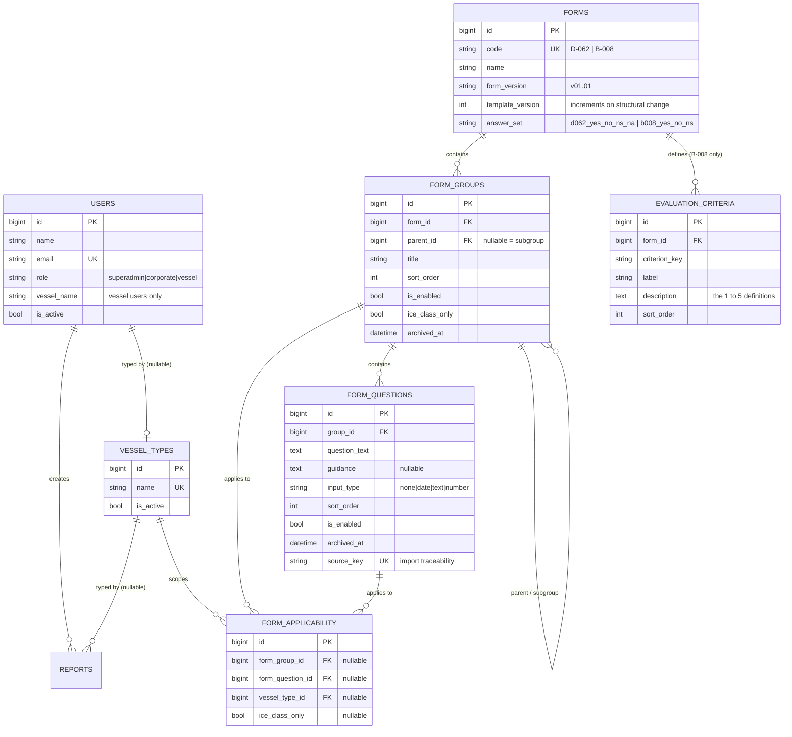
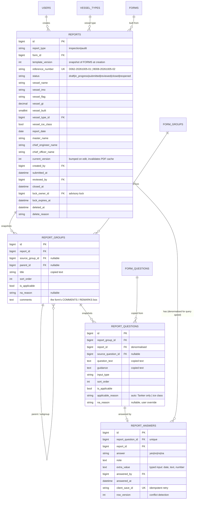
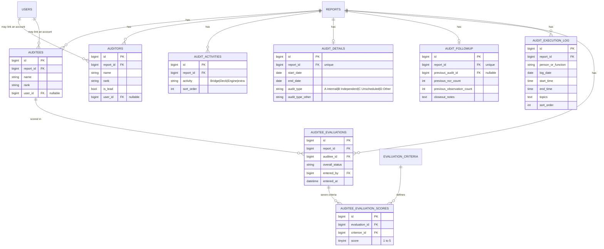
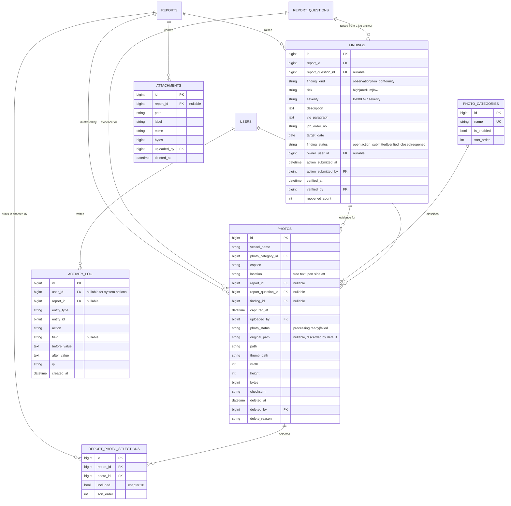

# ERD — Vessel Audit & Inspection App

Version 1.0
Derived from `SRS.md` v0.5, section 14 (Data model). Read together: where the SRS says
"why", this says "how". Nothing here contradicts the SRS; anything not covered here is
marked **TBD**.

---

## 1. Conventions

| Convention | Rule |
| --- | --- |
| Naming | `snake_case` tables and columns, singular table names, Laravel defaults (`id`, `timestamps`, `softDeletes` where relevant) |
| Roles | `users.role` enum: `superadmin`, `corporate`, `vessel` |
| Enums | Stored as `varchar` with a documented domain in section 7, so a value can be added without a migration. Not database enums, not magic integers |
| Timestamps | `*_at`, stored UTC (SRS NFR-16) |
| Calendar dates | `*_date`, no time component (SRS NFR-16) |
| Deletion | Template rows: `archived_at`. Reports and evidence: `deleted_at` + `delete_reason`. Nothing that reached `submitted` is ever hard deleted (RLS-8) |
| Vessel identity | `vessel_name` string, normalised on write (SRS 2.1). No `vessels` table |
| Audit trail | `activity_log` is append only, never updated, never deleted (NFR-9, NFR-17) |
| Money, weight, ratings | Not applicable in v1. `risk`, `severity` and `rating` are ordered enums, not numbers |

### 1.1 The three ideas that shape this ERD

1. **Template vs report.** `form_*` tables are the live, superadmin-editable catalogue.
   `report_*` tables are a **frozen copy** taken when a report is created (FM-8). Editing,
   disabling or deleting a template row never touches an existing report. Every report row
   carries its own copy of the text plus `source_*` back-references for traceability.
2. **No vessel table.** Vessel particulars are typed on the report; vessel users are scoped by
   `users.vessel_name`. Access checks compare normalised names, never IDs.
3. **Autosave.** An answer is the unit of saving. It therefore carries the machinery for
   idempotent retries (`client_save_id`) and conflict detection (`row_version`).

---

## 2. Diagram — Identity, reference and templates

`known_vessel_names` in the SRS is **not a table**. It is a `SELECT DISTINCT vessel_name`
over `users` and `reports`, used for autocomplete only.

---

## 3. Diagram — Report core and the snapshot

`report_answers.report_id` is denormalised on purpose: the group progress counters (INS-8)
and the unanswered filter are queried thousands of times per report, and joining through
two levels for that is wasteful on a shared host.

---

## 4. Diagram — Inspection (D-062) sections

```mermaid
erDiagram
    REPORTS ||--o{ REPORT_OPERATIONS : "has"
    REPORTS ||--o| REPORT_VOYAGE : "has"
    REPORTS ||--o| REPORT_PSC : "has"
    REPORTS ||--o{ REPORT_OPEN_ITEMS : "has"
    REPORTS ||--o{ REPORT_RATINGS : "has"
    REPORTS ||--o{ REPORT_TEXT_SECTIONS : "has"
    REPORTS ||--o{ REPORT_ATTENDANCE : "has"
    REPORTS ||--o{ REPORT_APPRAISALS : "has"
    REPORTS ||--o{ REPORT_CIRCULATION : "has"
    REPORTS ||--o{ REPORT_SIGNATURES : "has"
    ATTACHMENTS ||--o| REPORT_APPRAISALS : "optional file"

    REPORT_OPERATIONS {
        bigint id PK
        bigint report_id FK
        string operation_code "loading|bunkering|..."
        int sort_order
    }
    REPORT_VOYAGE {
        bigint id PK
        bigint report_id FK "unique"
        bool sailing_with_vessel
        string from_port
        string to_port
        string port
    }
    REPORT_PSC {
        bigint id PK
        bigint report_id FK "unique"
        string last_psc_port
        date last_psc_date
        bool detained
        bool deficiencies_found
        date last_drydock_date
        date next_drydock_date
    }
    REPORT_OPEN_ITEMS {
        bigint id PK
        bigint report_id FK
        string item_kind "open_item|memorandum|condition_of_class|recommendation|notation"
        text description
        date due_date
        string closeout_schedule
        int sort_order
    }
    REPORT_RATINGS {
        bigint id PK
        bigint report_id FK
        int chapter_no
        string item_label "copied from the form"
        string rating "very_good|satisfactory|unsatisfactory"
        bigint rated_by FK
        datetime rated_at
    }
    REPORT_TEXT_SECTIONS {
        bigint id PK
        bigint report_id FK
        string section_key "best_practices|safety_meetings|..."
        text body
    }
    REPORT_ATTENDANCE {
        bigint id PK
        bigint report_id FK
        string question_key "ten questions, INS-13"
        bool answer
        text detail
        int sort_order
    }
    REPORT_APPRAISALS {
        bigint id PK
        bigint report_id FK
        string officer_rank "master|chief_engineer|chief_officer|second_engineer"
        bool appraised
        string officer_name
        text comments
        bigint attachment_id FK "nullable"
    }
    REPORT_CIRCULATION {
        bigint id PK
        bigint report_id FK
        string role_label "copied from the form"
        date date_sent
        string reviewer_name
        date date_reviewed
        int sort_order
    }
    REPORT_SIGNATURES {
        bigint id PK
        bigint report_id FK
        string signature_role "lead_auditor|auditor|inspected_by|circulation"
        string signer_name
        date signed_date
    }
```

`report_signatures` stores the **name and date only**. No image is ever uploaded; signatures
stay manual (SRS section 2, REP-2).

---

## 5. Diagram — Audit (B-008) specifics

Evaluation scores are the most sensitive rows in the database: readable only by the audit
authors and Corporate Users (SRS section 2). Enforced in one policy, plus a database
constraint that `criterion_id` belongs to the audit's own form.

---

## 6. Diagram — Findings, photos, attachments, audit trail

---

## 7. Column reference and index notes

Only columns that carry a rule or a non obvious choice are listed. Standard columns
(`id`, `created_at`, `updated_at`) are omitted.

### 7.1 reports

| Column | Type | Notes |
| --- | --- | --- |
| `report_type` | enum | `inspection` (D-062) or `audit` (B-008). Separate from `form_id` so one form could be used both ways later |
| `form_id` | FK | The template this report was built from |
| `template_version` | int | Copied from `forms.template_version` at creation (FM-12) |
| `reference_number` | varchar, **unique** | `FORMCODE-YYYYMMDD-NN` (SRS RLS-7). Form code, the **report date** the inspector entered, and a daily sequence. The sequence exists because form code plus date collides when one inspector writes two reports of the same form on one day |
| `status` | enum | Section 10. Transitions validated by a policy, not in the UI |
| `vessel_name` | varchar, indexed | Normalised on write. Index because every vessel-scoped query filters on it |
| `vessel_gt`, `vessel_built` | decimal, smallint | Typed by the user (SRS 2.1) |
| `vessel_ice_class` | bool | Drives `ice_class_only` applicability (FM-4) |
| `current_version` | int | Bumped by every content edit. The PDF cache key (REP-6) |
| `lock_owner_id`, `lock_expires_at` | FK, datetime | Advisory edit lock, advisory only (NFR-15) |

Indexes: `(vessel_name, report_date)`, `(status, vessel_name)`, `(created_by, status)`,
`unique(reference_number)`.

### 7.2 report_groups / report_questions / report_answers

| Column | Table | Notes |
| --- | --- | --- |
| `title`, `question_text`, `guidance` | report_* | **Copied text** (FM-8). Never joined back to the template for display |
| `source_group_id`, `source_question_id` | report_* | Nullable back-reference for traceability and for "used in report" counts |
| `is_applicable`, `applicable_reason`, `na_reason` | report_questions | Inapplicable items stay in the report as auto `NA` with a reason (FM-4) |
| `comments` | report_groups | The form's COMMENTS / REMARKS box, one per group, not a question (FM-7a) |
| `answer` | report_answers | Domain depends on the form: D-062 `yes|no|ns|na`, B-008 `yes|no|ns` |
| `client_save_id` | report_answers | Client generated, unique. A retried autosave updates the same row instead of inserting twice (NFR-2) |
| `row_version` | report_answers | Incremented on every write. A save carrying a stale value is refused as a conflict (NFR-15) |
| `extra_value` | report_answers | Typed input for questions that have one (INS-7, AUD-7). Typed as string, validated per `input_type` |

Indexes: `unique(report_question_id)` on answers, `(report_id, answer)` for the
unanswered filter, `(report_id, parent_id, sort_order)` on groups.

### 7.3 findings

| Column | Notes |
| --- | --- |
| `finding_kind` | D-062 produces `observation`, B-008 produces `observation` or `non_conformity` |
| `risk` | D-062 only: High / Medium / Low, required when the answer is `No` (INS-9) |
| `severity` | B-008 NC severity |
| `report_question_id` | The `No` answer this came from. Nullable so a finding can be raised outside the checklist |
| `finding_status` | FND-3 lifecycle, v1.1. In v1 the column exists and stays `open` |
| `reopened_count` | Drives the "chronic finding" filter later |

### 7.4 photos

| Column | Notes |
| --- | --- |
| `vessel_name` | Copied from the report when the photo is taken for one, typed otherwise (PHO-2) |
| `photo_status` | `processing` until the queued optimiser finishes (IMG-5); `failed` keeps the error for the retry button (IMG-7) |
| `original_path` | Null after processing, because originals are discarded by default (IMG-3) |
| `checksum` | Duplicate detection on a flaky link re-uploading the same file |
| `deleted_at`, `delete_reason` | Soft delete only, and only before submission (PHO-7, RLS-4) |

Indexes: `(vessel_name, photo_category_id)`, `(report_id)`, `(finding_id)`, `(photo_status)`.

### 7.5 activity_log

Append only. No `updated_at`, no cascade deletes. Written for: answers, ratings, findings,
status transitions, template edits, permission changes, photo deletion, vessel name changes.
Not written for: reads, or for autosave retries that changed nothing (NFR-9).

---

## 8. Rules this schema enforces

| Rule | Where enforced |
| --- | --- |
| An old report never changes when a template is edited | Data copy into `report_*` (FM-8) |
| A used question is archived, never deleted | `archived_at`, no cascade from `form_questions` to `report_questions` |
| An inapplicable question is visible as `NA` with a reason | `report_questions.is_applicable` + `applicable_reason` (FM-4) |
| A retried autosave is not a new answer | `unique(report_question_id)` + `client_save_id` |
| Two people cannot silently overwrite each other | `row_version` + advisory `lock_owner_id` |
| Evaluation scores stay private | Policy on `auditee_evaluations`, plus form ownership check on `criterion_id` |
| Nothing submitted is deleted | `deleted_at` only on `draft` / `in_progress` (RLS-8) |
| A closed report is final | No transition out of `closed` is permitted (RLS-9) |
| Report numbers cannot collide | `unique(reference_number)` plus a transactional daily sequence (RLS-7) |
| A vessel user sees only their own vessel | `users.vessel_name` = `reports.vessel_name`, normalised comparison (SRS 2.1) |

---

## 9. Open items carried from the SRS

| # | Question | Effect on this ERD |
| --- | --- | --- |
| OQ-2 | Status list accepted; `closed` is final and never reopened | `closed` has no outgoing transition (RLS-9) |
| OQ-6 | Five year retention confirmed | Decides whether reports are archived to cold storage or dropped |
| OQ-7 | Report numbering is form code plus date plus daily sequence | `reference_number` format only |
| OQ-8 | Real user and report counts | Decides whether progress counters are pre computed columns or counted live |
| SRS 2.1 | Two vessels with the same name | Accepted as one vessel. If that changes, `vessel_names` becomes a real table and every `vessel_name` column becomes an FK |

---

## 10. Next step

Migrations in dependency order: reference and templates, then reports and snapshot, then
answers and findings, then photos and attachments, then the audit specifics. Each group is
followed by its factory and its first test, so the schema is proven before any UI work starts.